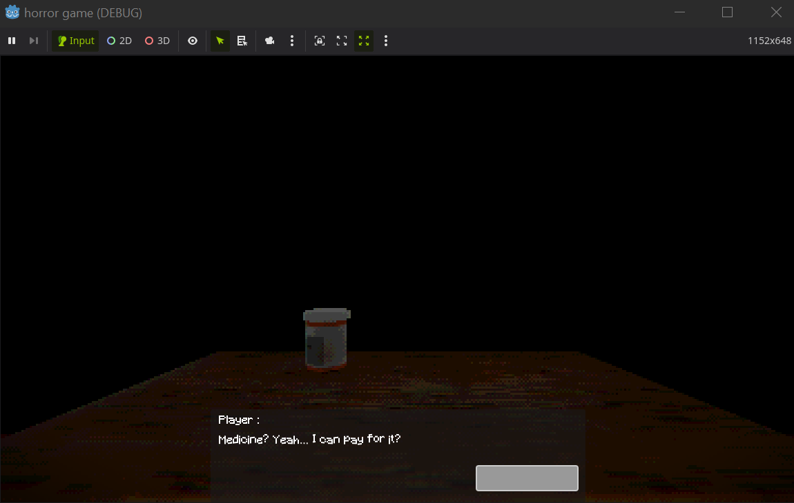

---

## ✅ Finished Features
- Player movement  
- Lobby — **80% complete**  
- ~~Forest — **40% complete**~~ (removed for now)
- Inventory system — **80% complete**  
- Read system  
- Door system  
- Event system  
- Camera changer  
- Visual effects (glitch, CFR, pixel)

---

## 📝 To-Do / Marks
- ❌ Remove the old enemy idea (3D model) ×2  
- ❌ Remove old event system  
- ❌ Remove the old forest place  
- ❌ Remove outline from interactable objects
- ⚡ Add dialog system
- ⚡ create 2d characters

---
#8ac09a
---
ScreenShots:

